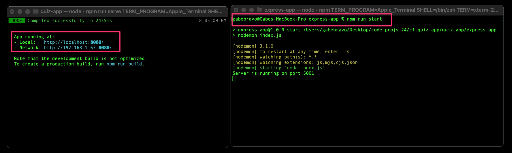
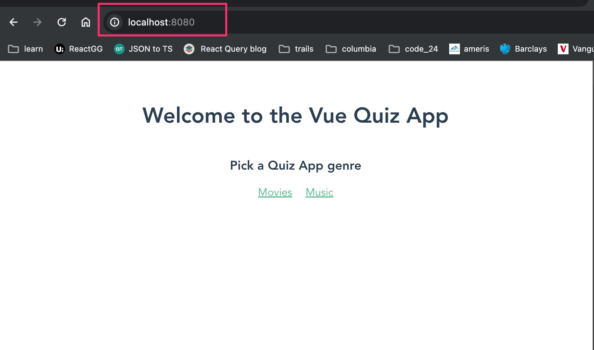

# vue-quiz-app

## Project setup

```
1. git clone git@github.com:gabebravo/vue-quiz-app.git
2. from the root folder and run : npm i
3. cd into ./express-app and run : npm i
```

### Compiles and hot-reloads for development

```
1. open 2 tabs in terminal for the root level vue app and another for the ./express-app
2. run >> npm run start to get the backend running
3. run >> npm run serve to the the vue app running
4. open >> http://localhost:8080/ in a browser tab
```

### Frontend and Backend running in Terminal



### App runing on localhost


